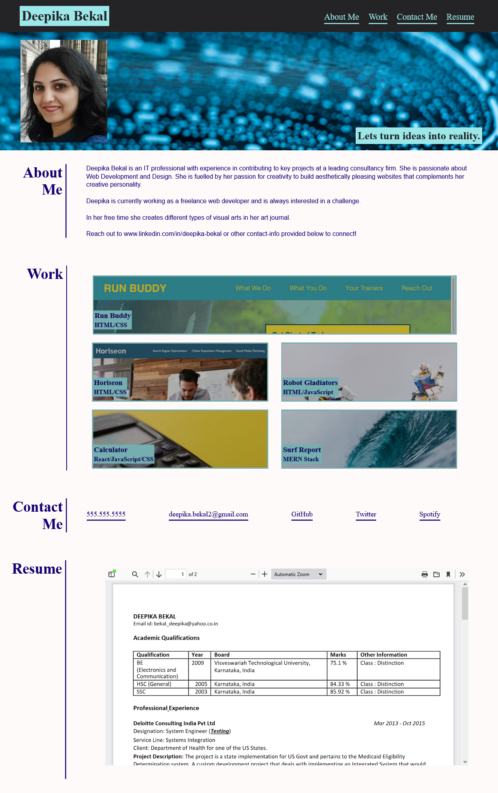

# Portfolio

[](https://opensource.org/licenses/MIT)

## Description
A portfolio website with all the information about the developer, applications , resume and contact information.

## Website
https://deepikabekal.github.io/Portfolio/

## Screenshot


## Technologies Used
* HTML
* CSS

## Contact Info
If any queries please send me an email at deepika.bekal2@gmail.com

## User Story
```
AS AN employer
I WANT to view a potential employee's deployed portfolio of work samples
SO THAT I can review samples of their work and assess whether they're a good candidate for an open position
```

## Acceptance Criteria
```
GIVEN I need to sample a potential employee's previous work
WHEN I load their portfolio
THEN I am presented with the developer's name, a recent photo, and links to sections about them, their work, and how to contact them
WHEN I click one of the links in the navigation
THEN the UI scrolls to the corresponding section
WHEN I click on the link to the section about their work
THEN the UI scrolls to a section with titled images of the developer's applications
WHEN I am presented with the developer's first application
THEN that application's image should be larger in size than the others
WHEN I click on the images of the applications
THEN I am taken to that deployed application
WHEN I resize the page or view the site on various screens and devices
THEN I am presented with a responsive layout that adapts to my viewport
```
## Notes

* When clicked on the links in the navigation you will be navigated to the respective section of the webpage.
* When hovered over an application, it will become bright and larger in size than other applications. 
* When clicked on the image of the application, you will be navigated to the deployed application in a new tab.
     * The applications Calculator and Surf Report are placeholder and hence when clicked on them, you will be navigated to www.google.com.
* When you resize the page, you will see a responsive layout that adapts to the respective viewport.
* When viewed the site on various screens and devices, you will see a responsive layout that adapts to the respective viewport.
* In the contact section, there are links for phone number, email, GitHub, spotify, twitter.
     * If you click on spotify and twitter, you will be directed to www.google.com.
* To view the embedded PDF viewer in mobile layout please use Firefox browser.


## References
* Study Material for HTML and CSS provided by Trilogy Education Services.
* Adding resume to the website (https://www.w3docs.com/snippets/html/how-to-embed-pdf-in-html.html)
* How to write a kickass README (https://dev.to/scottydocs/how-to-write-a-kickass-readme-5af9#template)
* Flexbox and Grid (https://css-tricks.com/snippets/css/a-guide-to-flexbox/)


